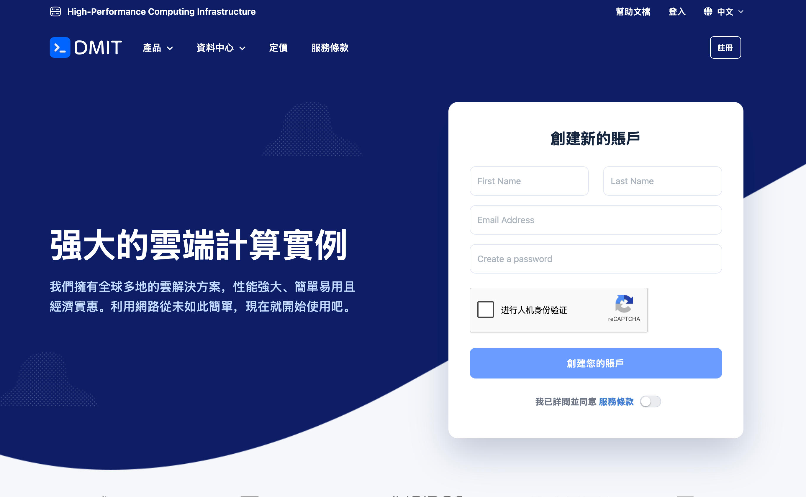
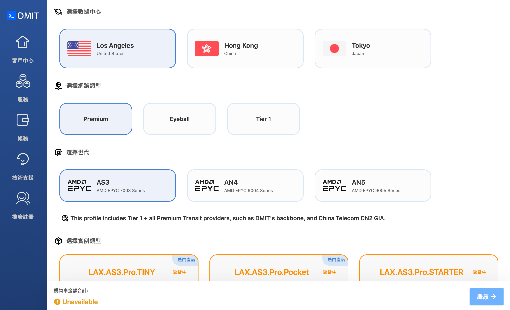
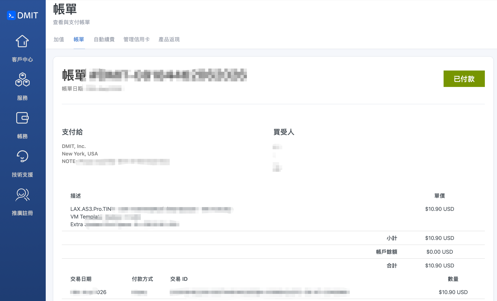
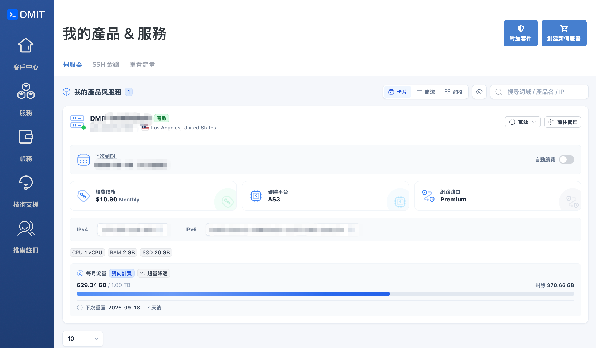

# 从 0 到 1：用 DMIT VPS + 3X-UI 搭建自己的代理服务器

> 本教程手把手教你租一台海外 VPS，并在上面部署开源面板 [3X-UI](https://github.com/MHSanaei/3x-ui)，
> 搭建一个只属于你自己的、稳定可控的代理服务。全程图文并茂，跟着做大约 15-20 分钟即可完成。

**免责声明与推广说明（请务必先读）**

- 本教程仅用于学习网络技术、保护个人隐私、访问速度优化等**个人合法用途**。请遵守你所在地区的相关法律法规，不要用于任何违法用途。
- 3X-UI 官方仓库也明确写明："This project is intended for personal use only. Please do not use it for illegal purposes or in a production environment."（本项目仅供个人使用，请勿用于非法用途或生产环境）。
- 文中购买 DMIT 的链接是我的**推广/返佣链接**，通过它注册并成功开通服务，我会获得相应佣金，对你的价格没有任何影响。如果你不想使用推广链接，也可以自行搜索 DMIT 官网注册，不影响教程后续步骤。

---

## 总览：我们要做什么

整个流程分三大步，一图看懂：

```
① 购买 VPS（DMIT）  →  ② 安装面板（3X-UI）  →  ③ 添加节点 + 客户端连接
   注册 / 下单 / 拿到IP        一键脚本安装              扫码 / 导入订阅即可用
```

准备工作：

- 一张可以支付外币的银行卡，或 DMIT 支持的其他支付方式（具体以官网结算页为准）
- 一台电脑（Windows / macOS 均可），会用最基础的终端命令
- 耐心 15-20 分钟

---

## 第一步：注册 DMIT 并购买一台 VPS

### 1.1 打开购买链接

点击我的推广链接进入 DMIT 官网：

👉 https://www.dmit.io/aff.php?aff=27305

DMIT 是一家老牌海外云服务商，提供 KVM 云主机（Cloud Instance）、独立服务器、IP Transit 等业务，多个机房支持"中国大陆优化线路"，访问速度相对友好。首页如下：


*（图：DMIT 官网首页，可以看到 Cloud Instance / BareMetal / IP Transit 等产品分类）*

> 📌 截图占位说明：DMIT 官网接入了 Cloudflare 人机验证，自动化工具无法直接截取内部页面。请在实际操作时，把下面每一步对应的页面自行截图替换到 `images/` 目录里（文件名已在图注中标好），这样发布到 GitHub 后教程会更完整。

### 1.2 选择套餐（Cloud Instance）

在导航栏点击 **Cloud Instance**，会看到按机房分类的套餐列表（如洛杉矶 LAX、香港、日本等）。新手第一次体验，建议：

- 选**月付**最低配置（如 1 核 1G 或 2 核 2G），先跑起来，不够用了随时在客户中心升级
- 机房优先选**标注"中国大陆优化线路 / CN2 GIA"**的节点，回国访问速度更好
- 不需要额外买独立 IP、快照等增值选项，够用即可


*（图：套餐选择页，标注了 CPU / 内存 / 硬盘 / 流量 / 线路信息）*

### 1.3 注册账号并下单

选好套餐点击 **Order Now / 立即购买**，会引导你：

1. 填写邮箱、设置密码，注册 DMIT 账号（如果已有账号直接登录）
2. 选择计费周期（月付 / 季付 / 年付，一般月付性价比最灵活）
3. 选择操作系统镜像，**建议选 Ubuntu 22.04 LTS 或 Debian 12**（教程后续以 Ubuntu 为例）
4. 核对订单信息，选择支付方式并完成支付


*（图：订单确认页，包含系统、周期、金额等信息）*

支付成功后，进入 DMIT **客户中心（Client Area）**，稍等几分钟系统会自动开通，你会在客户中心和注册邮箱里看到：

- 服务器 IP 地址
- root 密码（或者提示你通过面板设置密码）
- SSH 端口（默认 22）


*（图：客户中心里的服务器详情页，可以看到 IP、状态、重装系统、控制台等入口）*

到这里，第一步"买服务器"就完成了。

---

## 第二步：SSH 连接服务器，一键安装 3X-UI

### 2.1 用 SSH 连接你的 VPS

- **Windows** 用户：打开「终端 / Windows Terminal」或下载 [Xshell](https://www.xshell.com/)、[PuTTY](https://www.putty.org/) 等工具
- **macOS / Linux** 用户：直接打开「终端 App」

输入以下命令连接（把 `你的服务器IP` 换成 DMIT 客户中心里看到的真实 IP）：

```bash
ssh root@你的服务器IP
```

第一次连接会提示是否信任该主机，输入 `yes` 回车，然后输入 root 密码（粘贴时终端不会显示字符，属于正常现象，输完直接回车即可）。

看到类似下面的欢迎信息，说明连接成功：

```
Welcome to Ubuntu 22.04 LTS (GNU/Linux ...)
root@vps:~#
```

### 2.2 一键安装 3X-UI

3X-UI 是开源项目 [MHSanaei/3x-ui](https://github.com/MHSanaei/3x-ui) 提供的可视化面板，用来图形化管理 Xray 代理协议（VLESS / VMess / Trojan / Shadowsocks 等），不用手敲配置文件。

在 SSH 终端里执行官方一键安装脚本：

```bash
bash <(curl -Ls https://raw.githubusercontent.com/mhsanaei/3x-ui/master/install.sh)
```

脚本会自动完成：检测系统、安装依赖、下载最新版 3X-UI、配置系统服务。安装过程中会**随机生成登录用户名、密码和后台访问路径**，并打印在终端最后，请务必截图或复制保存，例如：

```
┌───────────────────────────────────────────────────────┐
│  Username: xxxxxxxx                                     │
│  Password: xxxxxxxx                                     │
│  Port: 2053                                              │
│  WebBasePath: /xxxxxxxxxx                                │
└───────────────────────────────────────────────────────┘
```

> 安装完成后，在终端输入 `x-ui` 回车，可以随时打开管理菜单：启动/停止服务、查看或重置账号密码、管理 SSL 证书等。

---

## 第三步：登录面板，添加节点

### 3.1 打开后台

在浏览器地址栏输入（把 IP、端口、路径换成你刚才保存的信息）：

```
http://你的服务器IP:2053/xxxxxxxxxx
```

输入用户名密码登录，看到概览页说明面板已经跑起来了：


*（图：3X-UI 面板概览页，可以看到 CPU / 内存 / 流量等服务器状态。图片来自 3X-UI 官方仓库 media 目录，仅作界面演示）*

**强烈建议先做两件安全加固**（在「面板设置」里）：

1. 修改默认的登录端口、访问路径为自定义值
2. 修改用户名密码为自己的强密码

### 3.2 添加入站（Inbound）

点击左侧「入站列表 / Inbounds」→「添加入站」，推荐新手选择：

- 协议：**VLESS**
- 传输方式：**REALITY**（伪装成正常 HTTPS 流量，抗封锁能力较强，且不需要自己的域名和证书）
- 端口：自定义一个 443 或其他常用端口
- 其余参数保持默认即可


*（图：添加入站配置页，图片来自 3X-UI 官方仓库）*

保存后，回到入站列表就能看到刚创建的节点：


### 3.3 添加客户端账号

点进刚才创建的入站，点击「添加客户端」，给这个节点生成一个使用者（可以理解为一把"钥匙"）：


保存后，点击客户端右侧的二维码图标，就能拿到**订阅链接 / 二维码 / 分享链接**：


*（图：以上三张均为 3X-UI 官方仓库 media 目录截图，用于展示面板真实界面，实际操作时请以你自己面板生成的二维码为准）*

---

## 第四步：客户端导入节点，开始使用

根据你的设备下载对应客户端（均为开源 / 主流常用软件）：

| 系统 | 推荐客户端 |
| --- | --- |
| Windows | v2rayN、NekoRay |
| macOS | V2rayU、Karing |
| iOS | Shadowrocket、Karing、Streisand |
| Android | v2rayNG、NekoBox for Android |

导入方式任选其一：

1. **扫码**：客户端里点"扫描二维码"，扫刚才面板生成的二维码
2. **粘贴订阅/分享链接**：客户端里选"从剪贴板导入"或"添加订阅"，粘贴面板给的链接

导入成功后，在客户端里点击"连接/启动"，然后打开浏览器访问 [ip.sb](https://ip.sb) 或 [whatismyip.com](https://www.whatismyip.com)，如果显示的 IP 变成了你 VPS 所在地区的 IP，就说明连接成功。

---

## 安全与使用建议（重要）

1. **只给自己/信任的人用**，不要把节点链接公开分享或倒卖，容易引来滥用和风控。
2. **定期更新面板和系统**：SSH 登录后执行 `x-ui` 选择更新选项，或者 `apt update && apt upgrade -y` 更新系统。
3. **开启防火墙**，只放行必要端口（SSH 端口、面板端口、节点端口），例如用 `ufw`：
   ```bash
   ufw allow 22
   ufw allow 2053
   ufw allow 443
   ufw enable
   ```
4. **SSH 尽量改用密钥登录**，禁用密码登录，减少被爆破的风险。
5. **不要在服务器上跑任何违法业务**，服务商一旦收到滥用投诉，可能直接封停账号和服务器，得不偿失。

---

## 总结

到这里，你已经完整走完了：

**注册 DMIT → 购买 VPS → SSH 连接 → 一键安装 3X-UI → 添加节点 → 客户端导入使用**

整个过程不需要写代码、不需要懂网络协议细节，跟着截图一步步点就能搭好一套属于自己的代理服务，速度和稳定性都由你自己掌控，不用再纠结"哪个免费节点又跑路了"。

如果这篇教程帮到了你，也欢迎通过我的 [DMIT 推广链接](https://www.dmit.io/aff.php?aff=27305) 支持一下～有问题欢迎在 Issue 里交流。

**参考链接**

- DMIT 官网：https://www.dmit.io/aff.php?aff=27305 （含推广码）
- 3X-UI 开源项目：https://github.com/MHSanaei/3x-ui
